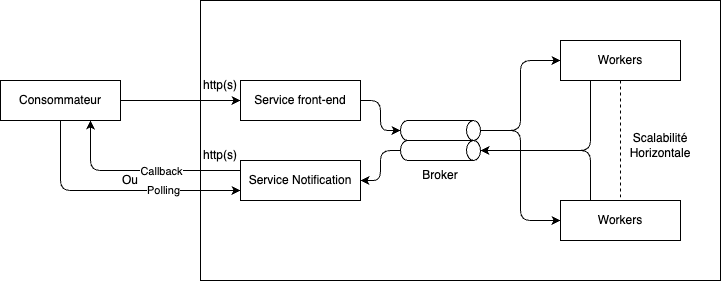
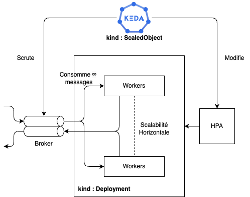
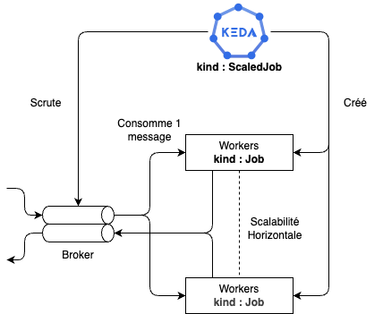
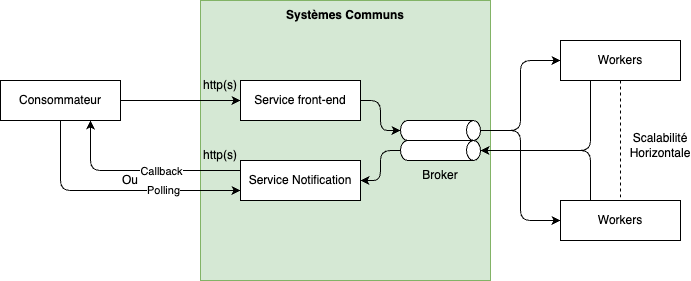
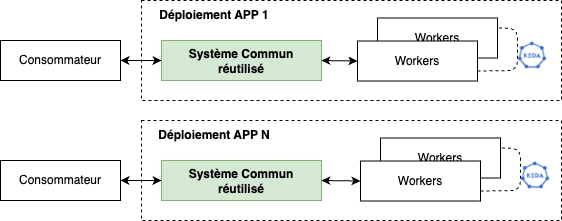
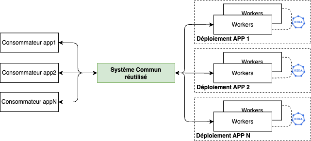
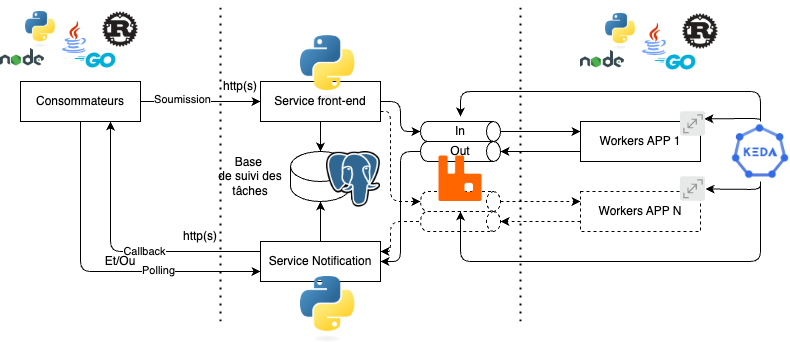
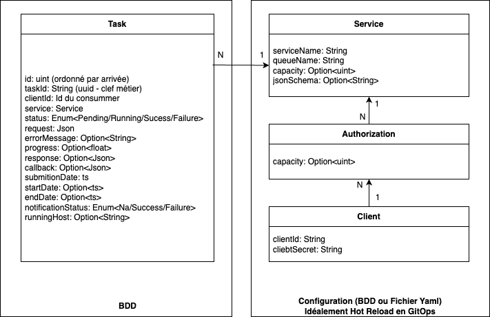
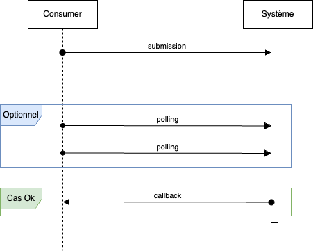
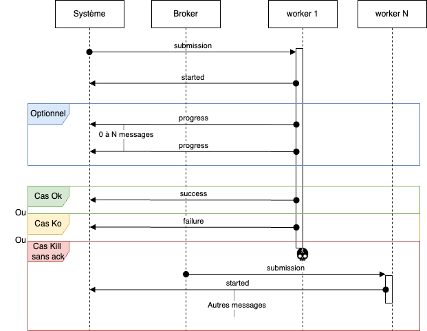

# Objectif du document

Les architectures asynchrones sont essentielles pour concevoir des applications cloud-native capables de gérer des charges variées, des traitements intensifs ou des délais d’exécution étendus. Dans un environnement comme Kubernetes, ces architectures permettent de découpler les composants, d’optimiser l’usage des ressources et d’améliorer la résilience des systèmes.

Ce chapitre propose une série de patrons d’architecture spécialement conçus pour les applications asynchrones déployées sur Kubernetes. Avant cela, il est important de comprendre pourquoi l’asynchronisme est souvent indispensable dans ce contexte.

# Pourquoi gérer des tâches de manière asynchrone

Deux cas principaux sont abordés :

- Pour maîtriser l’usage de ressources limitées: 
    
    Certaines tâches, bien que "relativement" rapides à exécuter, consomment beaucoup de ressources (CPU, RAM), ce qui limite leur parallélisation.

- Pour gérer des traitements de longue durée non interruptibles (sans possibilité de reprise):

    D’autres traitements, indépendamment des ressources, prennent simplement beaucoup de temps - ce qui est incompatible avec l'utilisation d'appels synchrones. 

Ces deux cas imposent une gestion fine des workloads : L’approche asynchrone permet alors de déléguer, découpler, voire distribuer l’exécution.

> __Attention__ cependant à ne pas appliquer les patrons décrits dans la suite du document dans des cas où des appels synchrones sont plus appropriés. L'approche asynchrone ajoutant une complexité non négligeable, à la fois dans l'architecture de déploiement et le code applicatif.

# Patron haut niveau

Le patron macroscopique le plus couramment utilisé pour la gestion d'appels asynchrones dans des architectures distribuées est le patron Event-Driven Architecture.

## Principe général

Les composants ne s’appellent pas directement mais communiquent via un bus de messages (souvent une file de messages ou un broker), ce qui permet de découpler l'émetteur du récepteur dans le temps et dans l’espace.

## Fonctionnement

1. Un producteur envoie un message (requête, événement, commande) dans un système de messagerie (ex: RabbitMQ, Kafka, SQS, NATS...) - il est même envisageable de passer par une base de données et du "polling" des workers dans les cas les plus simples. Dans notre cas nous voulons éviter les adhérences entre les consommateurs de service et les fournisseurs de service asynchrone, les consommateurs vont donc passer par un "service front-end" exposé en http(s) dont l'implémentation est à la responsabilité du fournisseur de service.
2. Un ou plusieurs consommateurs traitent ces messages de manière indépendante, souvent dans des workers scalables.
3. Le traitement est déclenché à la réception du message, pas au moment de l’envoi.
4. Le résultat peut être retourné de manière indirecte (callback, réponse dans un autre topic/queue, polling d’état...). Cette fonctionnalité peut être abstraite par un "service de notification".




## La gestion de la mise à l'échelle des workers

Lorsque l’on adopte une architecture asynchrone, il ne suffit pas de traiter les tâches en arrière-plan : il faut aussi être capable de scaler dynamiquement les workers en fonction du volume de travail à absorber. L’objectif est de garantir que les traitements s’exécutent dans des délais raisonnables, tout en optimisant l’usage des ressources.

### Cas des déploiements

Kubernetes fournit nativement le Horizontal Pod Autoscaler (HPA), qui ajuste le nombre de pods en fonction de métriques comme la CPU ou la mémoire. Cela fonctionne bien pour des workloads synchrones (ex: API REST sous pression), mais c’est insuffisant dans un contexte asynchrone, où le facteur déclencheur du traitement est souvent une file de messages, un topic Kafka, ou encore une base de données de tâches.

C’est pour cette raison que KEDA est utilisé. KEDA est un composant léger qui s’intègre nativement avec Kubernetes pour permettre un autoscaling basé sur des événements externes. Il agit comme une extension du HPA, en exposant des métriques personnalisées dérivées de sources asynchrones.

- KEDA interroge périodiquement une source d’événements (ex: la longueur d’une queue Redis, le nombre de messages RabbitMQ, le nombre d’entrées dans une base, etc.).
- En fonction de ces données, il déclenche ou adapte dynamiquement le scaling des pods (modification du HPA).
- Il peut même mettre l’application à zéro pods en absence de charge (mode scale-to-zero), réduisant ainsi les coûts.



Dans le cas de l'utilisation de déploiement, les workers sont en écoute permanente des queues et traitent les messages au fur et à mesure de leur arrivée. Le niveau de parallélisation de chaque worker est géré applicativement (c'est ce nombre qui limite la quantité de ressource utilisé par chaque processus). Keda ne fait alors que modifier le nombre de réplicas via le HPA en fonction du stock de message à traiter.

__Attention__ : Les déploiements peuvent être interrompus à tout moment par Kubernetes, notamment :

- Lors du "down-scaling" du HPA - source principale de risque ;
- Lors des mises à jour applicatives (rolling update) ;
- Lors de l'éviction d'un noeud (drain) ;

Ce processus d'interruption passe d'abord par un signal `SIGTERM` laissant la possibilité à l'application de réagir à la demande de kubernetes, puis, si le processus est toujours présent au bout de `terminationGracePeriodSeconds` secondes, un signal `SIGKILL` est envoyé (celui-ci ne peut être intercepté), et le processus est tué.

Il est donc indispensable de gérer correctement le signal `SIGTERM`:

- Ne plus accepter de nouveaux messages (stopper les listeners) ;
- Si les tâches sont __non interruptibles__, configurer un `terminationGracePeriodSeconds` supérieur à l'ordre de grandeur de traitement de la tâche. Ce point implique d'avoir dans ce cas un temps de traitement "raisonnable", c'est à dire un `terminationGracePeriodSeconds < 2mn` environ. Imaginons une valeur non raisonnable de l'ordre de 30mn, l'impact immédiat serait une mise à jour applicative supérieure à 30mn lors du rolling update. La conséquence immédiate est que les déploiements sont à reserver pour des tâches __non interruptibles__ si et seulement si elles sont __courtes__.
- Si les tâches sont interruptibles (et idempotentes): provoquer l'arrêt des tâches en cours d'exécution, éventuellement stocker l'état du traitement actuel (checkpoint), et faire en sorte de réemmettre l'événement dans le bus de messages. Dans le cas de RabbitMq, il est possible de gérer cette forme de réémission en utilisant la combinaison: `basic.nack` et `requeue=true`.

    - `basic.nack`: C’est une méthode du protocole AMQP qui permet de refuser un ou plusieurs messages déjà livrés mais non encore ack.
    - `requeue=true` : Cela indique à RabbitMQ de remettre le message dans la file au lieu de le supprimer ou de l'envoyer vers une DLQ.

- Lorsque tout ce séquencement est terminé, éteindre le processus : `exit(0)`.


### Cas des jobs

Ces objets kubernetes ne sont pas scalables nativement : un Job représente une exécution unique, déclenchée manuellement ou selon un horaire (CronJob).

KEDA propose une composant (`ScaledJob`) permettant d'exécuter et scaler dynamiquement des Jobs.
Le `ScaledJob` de KEDA permet de créer automatiquement plusieurs instances d’un Job en fonction du volume de travail détecté dans une source d’événements. Contrairement au Job standard de Kubernetes, le `ScaledJob` peut lancer plusieurs Jobs en parallèle (jusqu’à une limite configurable) et peut relancer des Jobs dès qu’il détecte de nouvelles tâches.

- KEDA surveille une source d’événements comme dans le cas des déploiements.
- S’il détecte une charge, il déclenche un ou plusieurs Jobs Kubernetes.
- Chaque Job traite une unité de travail, puis s’arrête.
- KEDA continue à en déclencher jusqu’à retour à un état nominal.



Dans le cas de l'utilisation de job, les workers sont en écoute d'un et un seul message. Le Job s'exécute puis termine son exécution.

__Attention__ : Les `Jobs`, au même titre que les déploiements peuvent être interrompus à tout moment par Kubernetes, notamment lors de l'éviction d'un noeud (drain) - c'est l'un des cas le plus risqué dans le cas des Jobs. Le processus d'arrêt est identique au cas des `Deployments`.

Mitigation possible :

- Si les tâches sont __non interruptibles__, configurer un `terminationGracePeriodSeconds` supérieur à l'ordre de grandeur de traitement de la tâche, par exemple `terminationGracePeriodSeconds = 30mn` (le noeud ne pourra cependant pas être supprimé du cluster pendant les 30mn restantes).
- Si les tâches sont interruptibles (et idempotentes): provoquer l'arrêt de la tâche en cours d'exécution (cf. cas du `Deployment`)
- Lorsque tout ce séquencement est terminé, éteindre le processus : `exit(0)`.

La seule stragégie permettant de mitiger le risque d'arrêt d'un Job dans le cas d'un node "drain" (fréquent lors de l'auto-scaling/down-scaling de noeuds): utiliser un nodeSelector, affinity, ou taints pour le planifier sur un nœud "stable" qui ne downscale pas.

### Critères de choix entre Job et Deployment

- __Tâche longue non interruptible__: `Jobs` (mais problème persistant sur le drain des noeuds) ;
- __Tâche longue interruptible__ (soit rejeu complet, soit checkpoint) : `Deployments` ;
- __Tâches courtes interruptibles ou non__: `Deployments` ;

Inconvénient des Jobs :

- Temps de démarrage plus long, moins de réactivité dans la consommation des messages :

    - lié à la période de polling de Keda ;
    - mais aussi au temps de démarrage de chaque Job pour chaque message ;

- Moins optimal en termes de ressources (1 processus par message, pas de parallélisation) ;
- Solution de remontée de métriques plus ardue (Push Gateway prometheus pour les Jobs par exemple) ;

# Déclinaison dogmatique 

## Concept

Si nous revenons au patron macroscopique, nous observons qu'une grande partie du système de gestion 
de l'asynchronisme risque d'être dupliqué autant de fois que de services asynchrones implémentant ce même patron.



Il est dès lors tentant de mutualiser cet effort et développer de manière transverse ce système pour en faire :

1. Soit un système réutilisable (module unique déployé autant de fois que de jobs asynchrones) ;
2. Soit un système complètement transverse (déployé une unique fois);


**Réutilisé** 



**Mutualisé**      




Remarquons que les deux visions ne sont pas antithétiques et n'ont pas d'impact réel sur le développement et l'architecture du module (au mécanisme de routing près). Nous choisissons donc la seconde hypothèse - qui inclut dès facto la première. 

En tant que développeur d'un service asynchrone, il n'est donc nécessaire de développer que le Job ou le Déploiement coeur metier de mon service asynchrone et la couche de communication avec le 'Système Commun'.

## Architecture du système



Les technologies : 

- Les modules "Service Front-End" et "Service Notification" sont développé en Python. 

    _Critère(s) de choix_: Large communauté de développeurs python au Ministère.

- La base de données permettant le suivi des tâches est un base de données PostgreSql. 

    _Critère(s) de choix_: Choix de SGBD par défaut dans l'écosystème PI-Native, opérateur CNPG déjà déployé sur les clusters.

- Le système de message est basé sur RabbitMq.

    _Critère(s) de choix_: 
        
    - Facilité d’utilisation & d’intégration : très simple à configurer, de nombreux clients dans plusieurs langages (critères très important puisque les workers devront s'intégrer directement au système de messages).
    - Fiabilité & garanties de livraison : supporte les accusés de réception (ack), la redélivrance, le routage complexe (topics, headers, fanout...). Dans notre cas le mécanisme d'ack est incontournable.
    - Priorisation & délais : permet de définir des files avec TTL, des messages avec délai, de la priorisation.
    - Persistant ou non : messages peuvent être persistés sur disque ou non, selon les besoins.

    > Une attention particulière doit être portée sur la configuration des queues :
    > - _timeout des ack_: cf: [documentation Rabbitmq](https://www.rabbitmq.com/docs/consumers#:~:text=The%20default%20timeout%20value%20for%20RabbitMQ%20is%2030%20minutes.). Il doit être choisi conformément à la durée estimée des exécutions de tâches pour chaque queue (par défaut 30mn).
    > - _ttl des messages_: doit être conforme aux aspects fonctionnels de chaque service.

- Scalbilité horizontale : Gestion via KEDA.

    _Critère(s) de choix_: Solution simple et robuste, déjà intégrée dans Pi-Native, supporte RabbitMq.

- Worker et Consumers : Ils sont agnostique de la solution.

## Modèle de données



Légende:

- Un champ Option\<x> signifie que le champ est de type 'x', mais peut être vide.
- Un champ Enum\<x/y/s/t> signifie que le champ est une énumération et ne peut prendre que les valeurs x,y,z ou t.
- Un champ Bcrypt\<x> signfie que le champ est de type x mais chiffré avec bcrypt.

### Task

Cette entité est stockée en base et existant pour chaque tâche créé. Il sera nécessaire de prévoir un mécanisme de purge journalière des tâches terminées, en erreur, et aux autres status si la tâche est trop ancienne.

| **Attribut**       | **Type** | **Optionnel** | **Description**                                                                                                                                                                                                             |
|--------------------|----------|---------------|-----------------------------------------------------------------------------------------------------------------------------------------------------------------------------------------------------------------------------|
| id                 | uint     | Non           | champ issu d'une séquence, permettant d'ordonner les tâches par ordre d'arrivée.                                                                                                                                            |
| taskId             | String   | Non           | uuid (v4 par exemple), représentant l'identifiant "métier" de la tâche.                                                                                                                                                     |
| clientId           | String   | Non           | ClientId du consommateur                                                                                                                                                                                                    |
| service            | String   | Non           | nom du service cible invoqué                                                                                                                                                                                                |
| status             | String   | Non           | Status actuel de la tâche (__Pending__: lorsque créé, __Running__: lorsqu'une tâche débute son exécution, __Success__ ou __Failure__ en fin de traitement)                                                                  |
| request            | Json     | Non           | Arguments envoyés à la tâche (en format Json)                                                                                                                                                                               |
| errorMessage       | String   | Oui           | Si le status et Failed : message d'erreur de retour de la tâche.                                                                                                                                                            |
| progress           | float    | Non           | Etat d'avancement du traitement, si le service supporte l'envoi d'états de progression, sinon passe de 0 à 100 (Pending -> Success)                                                                                         |
| response           | String   | Oui           | Résponse finale du service cible.                                                                                                                                                                                           |
| callback           | String   | Oui           | Si présent, déclenche un appel à ce callback lors de la fin du traitement (Success ou Failure). Le contenu est en Json de manière à supporter dans le futur différents types de callback `{ "type":"https", url: "....."}`. |
| submitionDate        | datetime | Non           | Timestamp d'arrivée du message (date d'insertion de la tâche).                                                                                                                                                              |
| startDate        | datetime | Oui           | Timestamp de début de traitement de la tâche par un worker.                                                                                                                                                                 |
| endDate            | datetime | Oui           | Timestamp de fin de traitement (Success ou Failure).                                                                                                                                                                        |
| notificationStatus | String   | Oui           | Si un callback est spécifié, stocke l'état de notification __Success__ ou __Failure__.                                                                                                                                      |
| workerHost         | String   | Oui           | Stocke le nom d'host (pod name), du job en cours d'exécution.                                                                                                                                                               |
### Service

Cette entité décrit le `service` cible.  

| **Attribut** | **Type** | **Optionnel** | **Description** |
|--------------|----------|---------------|-----------------|
| serviceName  | String   | Non           | Nom du service  |
| queueName | String | Non | Préfixe de la queue in/out: `<queueName>-in`, `<queueName>-out`
| capacity | int | Oui | Si présent, la création d'un nouvelle tâche en base ne peut etre effectuée que si le nombre de tâches `Pending` de service est inférieur à `capacity`. Sinon la demande est rejetée. |
| jsonSchema | String | Oui | Si présent, la demande d'exécution d'un service n'est acceptée que si le json `request` est conforme au jsonSchema fourni. L'objectif le rejet de requetes invalides dès que possible. |

### Client

Cette entité définit l'authentification d'un consommateur de service.  

| **Attribut** | **Type** | **Optionnel** | **Description**  |
|--------------|----------|---------------|------------------|
| clientId     | String   | Non           | Id du client     |
| ClientSecret | String   | Non           | Secret du client |

### Authorization

Cette entité définit les droits d'un client. Elle est liée à un client et à un service.

| **Attribut** | **Type** | **Optionnel** | **Description** |
|--------------|----------|---------------|-----------------|
| capacity  | String   | Oui           | Cf. capacity du service, mais cette fois-ci lié au client lui-même.  |

## Api à disposition des consommateurs de services



> En cas de kill sans ACK, un nouveau worker consomme le message, le système modifie le modèle "Task" en base, à la réception du nouveau message `started` envoyé par le nouveau worker :
>
>   - Modification du `workerHost` ;
>   - Reset du `progress` à 0.0 ;
>   - Reset du `startDate` à la date courante ;
>

### Création d'une tâche

#### Requête

```json
POST /v1/services/<service-name>/tasks/
Authorization: Basic base64(<client-id>:<client-secret>)

{
    "body": <service-body>,
    "callback": {
        "type": "https",
        "url": <callback-url>, 
    }
}
```

| **Variable** | **Optionnel** | **Description** |
|--------------|---------------|-----------------|
|  client-id  | NON             | Id du consommateur de service, celui-ci doit être explicitement autorisé à consommer le service cible. |
| client-secret | NON | Secret associé au consommateur de service |
| service-name | NON | Nom du service cible |
| service-body | NON | Json object, argument du service cible. Cet objet peut éventuellement être validé contre le json-schema du service cible s'il est fournit. |
| callback | OUI | Peut être vide, dans ce cas, aucune notification ne sera envoyée en fin de tâche. Ce cas suppose une vérification en mode polling du consommateur s'il a besoin de suivre l'état de la tâche. |
| callback.type | NON | Actuellement seul le callback de type `https` est supporté, mais dans le futur, une implémentation `amqp` (rabbitmq) pourrait être envisagée. |

#### Réponses 

--- 

Cas nominal

```json
Status: 201

{
    "status": "success",
    "data": {
        "taskId": "089373b8-1691-4462-8f78-25e3af1a1c6b",
        "taskPosition": 12,
    }
}
```

--- 

Cas d'erreur

_Forme générale:_

```json
Status: <status-code>

{
    "status": "error",
    "error": {
        "number": <error-number>,
        "description": <error-message>,
    }
}
```

_Valorisation selon les cas d'erreur:_


| **status-code** | **error-number** | **error-message**                                                | **Description**                                                                                              |
|-----------------|------------------|------------------------------------------------------------------|--------------------------------------------------------------------------------------------------------------|
| 404             | 404 001          | Service not found.                                               | Cas de l'invocation d'un service inexistant                                                                  |
| 400             | 404 001          | Error validating the body with the target service's json-schema. | Cas de mauvaise validation de json-schema du `body` (si un json-schema est fourni pour le service cible)     |
| 403             | 403 001          | Forbidden.                                                       | Cas de droits nécessaires insiffisants pour appeler le service (ou couple CLIENT-ID/CLIENT-SECRET incorrect) |
| 429             | 429 001          | Too many service requests                                        | Cas d'une capacité insuffisante (Globale au service)                                                         |
| 429             | 429 002          | Too many service requests for the clientId.                      | Cas d'une capacité insuffisante (Pour le client)                                                             |


### Polling d'une tâche

#### Requête

```json
GET /v1/services/<service-name>/tasks/<task-id>
Authorization: Basic base64(<client-id>:<client-secret>)
```

#### Réponse

---

En attente:

```json
Status: 200

{
    "status": "success",
    "data": {
        "taskId": "089373b8-1691-4462-8f78-25e3af1a1c6b",
        "status": "PENDING",
        "taskPosition": 12,
        "submitionDate": "2025-04-23T18:25:43.511Z"
    }
}
```

---

En cours:

```json
Status: 200

{
    "status": "success",
    "data": {
        "taskId": "089373b8-1691-4462-8f78-25e3af1a1c6b",
        "status": "IN_PROGRESS",
        "submitionDate": "2025-04-23T18:25:43.511Z",
        "startDate": "2025-04-23T20:15:11.322Z",
        "progress": 10.0,
    }
}
```
---

Terminé avec succès:

```json
Status: 200

{
    "status": "success",
    "data": {
        "taskId": "089373b8-1691-4462-8f78-25e3af1a1c6b",
        "status": "SUCCESS",
        "submitionDate": "2025-04-23T18:25:43.511Z",
        "startDate": "2025-04-23T20:15:11.322Z",
        "endDate": "2025-04-22T10:21:12.423Z",
        "progress": 100.0,
        "response": { ... }
    }
}
```

---

Terminé en erreur:

```json
Status: 200

{
    "status": "success",
    "data": {
        "taskId": "089373b8-1691-4462-8f78-25e3af1a1c6b",
        "status": "FAILURE",
        "submitionDate": "2025-04-23T18:25:43.511Z",
        "startDate": "2025-04-23T20:15:11.322Z",
        "endDate": "2025-04-22T10:21:12.423Z",
        "progress": 10.0,
        "errorMessage": "Argh!"
    }
}
```


--- 

Cas d'erreur

_Forme générale:_

```json
Status: <status-code>

{
    "status": "error",
    "error": {
        "number": <error-number>,
        "description": <error-message>,
    }
}
```

_Valorisation selon les cas d'erreur:_


| **status-code** | **error-number** | **error-message**                                                | **Description**                                                                                              |
|-----------------|------------------|------------------------------------------------------------------|--------------------------------------------------------------------------------------------------------------|
| 404             | 404 001          | Service not found.                                               | Cas de l'invocation d'un service inexistant                                                                  |
| 404             | 404 002          | Task not found.                                               | Tâche inexistante.                                                                  |
| 403             | 403 001          | Forbidden.                                                       | Cas de droits nécessaires insiffisants pour appeler le service (ou couple CLIENT-ID/CLIENT-SECRET incorrect) |


                                                     
## Callback exposé par les consommateurs

Le callback est optionnel - mais son absence impose un polling du consommateur. 

Il est important de prévoir, côté service notification, un mécanisme de retry (de l'ordre de 3 tentatives),
suivant un pattern `exponential backoff`.

Le format de l'appel du service de notification est de la forme suivante (le body est le même que le champ `data` retourné par le polling) :

---

Terminé avec succès:

```json
POST <callbackurl>

{
    "taskId": "089373b8-1691-4462-8f78-25e3af1a1c6b",
    "status": "SUCCESS",
    "submitionDate": "2025-04-23T18:25:43.511Z",
    "startDate": "2025-04-23T20:15:11.322Z",
    "endDate": "2025-04-22T10:21:12.423Z",
    "progress": 100.0,
    "response": { ... }
}
```

---

Terminé en erreur:

```json
Status: 200

{
    "taskId": "089373b8-1691-4462-8f78-25e3af1a1c6b",
    "status": "FAILURE",
    "submitionDate": "2025-04-23T18:25:43.511Z",
    "startDate": "2025-04-23T20:15:11.322Z",
    "endDate": "2025-04-22T10:21:12.423Z",
    "progress": 10.0,
    "errorMessage": "Argh!"
}
```

## Communication entre le système et les workers



--- 

### Soumission d'une tâche par le consommateur

Message envoyé par le système

```json
{
    "taskId": "089373b8-1691-4462-8f78-25e3af1a1c6b",
    "data": {
        "messageType": "submission",
        "body": { ... }
    }
}
```

---

### Réponse du worker au début du traitement de la tâche

```json
{
    "taskId": "089373b8-1691-4462-8f78-25e3af1a1c6b",
    "data": {
        "messageType": "started",
        "hostName": "myjob-d49t6",
    }
}
```
---

### Réponse du worker s'il implémente les messages de progression

```json
{
    "taskId": "089373b8-1691-4462-8f78-25e3af1a1c6b",
    "data": {
        "messageType": "progress",
        "progress": 10.0,
    }
}
```

---

### Réponse du worker en fin de traitement (success)

```json
{
    "taskId": "089373b8-1691-4462-8f78-25e3af1a1c6b",
    "data": {
        "messageType": "success",
        "response": {}
    }
}
```

---

### Réponse du worker en fin de traitement (failure)

```json
{
    "taskId": "089373b8-1691-4462-8f78-25e3af1a1c6b",
    "data": {
        "messageType": "failure",
        "errorMessage": "Argh!"
    }
}
```

## Exemple de code d'un consommateur JS

### Code

```javascript
const amqp = require('amqplib');
const os = require('os');

//------------------------
// CONFIGURATION
//------------------------
const RABBITMQ_URL = process.env.RABBITMQ_URL || 'amqp://localhost:5672';
const RABBITMQ_USER = process.env.RABBITMQ_USER || 'kalo';
const RABBITMQ_PASSWORD = process.env.RABBITMQ_PASSWORD || 'kalo';
const LISTENER_COUNT = Number(process.env.LISTENER_COUNT) || 5;

const IN_QUEUE_NAME = process.env.IN_QUEUE_NAME || 'example';
const OUT_QUEUE_NAME = process.env.OUT_QUEUE_NAME ||'example_out';

//------------------------
// FRAMEWORK
//------------------------

// Utilitaire d'envoie de message (Started/End)
class MessageSender {
    constructor(rabbitmqUrl, rabbitmqUser, rabbitmqPassword, outQueue) {
        this.rabbitmqUrl = rabbitmqUrl;
        this.rabbitmqUser = rabbitmqUser;
        this.rabbitmqPassword = rabbitmqPassword;
        this.outQueue = outQueue;
    }

    async _sendMessage(message) {
        const opt = { credentials: amqp.credentials.plain(this.rabbitmqUser, this.rabbitmqPassword) };
        const connection = await amqp.connect(this.rabbitmqUrl,opt);

        const channel = await connection.createChannel();
        await channel.assertQueue(this.outQueue, { durable: true });

        channel.sendToQueue(this.outQueue, Buffer.from(JSON.stringify(message)), {
            persistent: true,
        });

        console.log("Message envoyé:", message);
        await channel.close();
        await connection.close();
    }

    async sendStartMessage(task_id) {
        await this._sendMessage({
            task_id: task_id,
            data: {
                message_type: "started",
                hostname: os.hostname()
            }
        })
    }

    async sendSuccessMessage(task_id, result) {
        await this._sendMessage({
            task_id: task_id,
            data: {
                message_type: "success",
                response: result
            }
        }) 
    }

    async sendFailureMessage(task_id, cause) {
        await this._sendMessage({
            task_id: task_id,
            data: {
                message_type: "failure",
                error_message: cause
            }
        }) 
    }

    async sendProgressMessage(task_id, progress) {
        await this._sendMessage({
            task_id: task_id,
            data: {
                message_type: "progress",
                progress: progress
            }
        }) 
    }
}

// Consumer et exécution des tâches
class TaskManager {
    constructor(rabbitmqUrl, rabbitmqUser, rabbitmqPassword,inQueue, outQueue, parallelism, taskFactory,oneShot) {
        this.rabbitmqUrl = rabbitmqUrl;
        this.rabbitmqUser = rabbitmqUser;
        this.rabbitmqPassword = rabbitmqPassword;
        this.inQueue = inQueue;
        this.outQueue = outQueue;
        this.parallelism = parallelism;
        this.taskFactory = taskFactory;
        // Etat interne
        this.channels = [];
        this.inFlightMessages = new Map(); // Map(channel -> msg)
        this.isShuttingDown = false;
        this.messageSender = new MessageSender(rabbitmqUrl, rabbitmqUser, rabbitmqPassword, outQueue);
        this.oneShot = oneShot;
    }

    async start() {
        let connection = null;
        while (true) {
            const opt = { credentials: amqp.credentials.plain(this.rabbitmqUser, this.rabbitmqPassword) };
            try {
                connection = await amqp.connect(this.rabbitmqUrl,opt);
                break;
            } catch (error) {
                console.log("Connection error, retry in 2s.")
                await sleepMs(2000)
            }
        }
        // Gestion SIGTERM
        process.on('SIGTERM', async () => {
            await this.shutdown(connection);
        });
        process.on('SIGINT', async () => {
            await this.shutdown(connection);
        });


        for (let channelIndex = 0; channelIndex < this.parallelism; channelIndex++) {
            const channel = await connection.createChannel();
            this.channels.push(channel);

            await channel.assertQueue(this.inQueue, { durable: true });
            channel.prefetch(1);

            console.log(`[Listener ${channelIndex}] En attente de messages...`);

            channel.consume(
                this.inQueue,
                async (msg) => { this.onMessage(channelIndex,msg) },
                { noAck: false }
            );
        }
    }

    async onMessage(channelIndex,msg) {
        let channel = this.channels[channelIndex];
        this.inFlightMessages.set(channel, msg); // suivi du msg en cours

        const content = msg.content.toString();
        console.log(`[Listener ${channelIndex}] Reçu : ${content}`);
        const submissionMessage = this.parseSubmissionMessage(content);

        try {
            if (submissionMessage) {
                console.log(`[Listener ${channelIndex}] Submission : `,submissionMessage);
                try {
                    await this.messageSender.sendStartMessage(submissionMessage.task_id);
                    let task = this.taskFactory();
                    let result = await task.run(submissionMessage.task_id,submissionMessage.data.body,(p) => this.messageSender.sendProgressMessage(submissionMessage.task_id,p));
                    await this.messageSender.sendSuccessMessage(submissionMessage.task_id,result);
                } catch (err) {
                    await this.messageSender.sendFailureMessage(submissionMessage.task_id,err);
                }
            } else {
                console.error(`[Listener ${channelIndex}] Message invalide : ${content}`);
            }
        } catch (err) {
            console.error(`[Listener ${channelIndex}] Erreur :`, err);
        } finally {
            // Dans tous les cas on ACK!
            channel.ack(msg);
            this.inFlightMessages.delete(channel);
        }
        if (this.oneShot) {
            // Sigterm par défaut
            process.kill(process.pid)
        }
    }

    parseSubmissionMessage(content) {
        try {
            let json = JSON.parse(content); 
            if (json.task_id && json.data && json.data.message_type && json.data.body) {
                return json;
            } else {
                return null;
            }
        } catch (err) {
            return null;
        }
    }

    async shutdown(connection) {
        // Parfois le signal arrive 2 fois.
        if (this.isShuttingDown) {
            return;
        }
        console.log('SIGTERM reçu. Nettoyage en cours...');
        this.isShuttingDown=true;

        // Arret des channels sans message en cours.
        // On ne veut pas qu'un channel en attente
        // puisse capter un message lors de l'arret
        // d'un autre listener (requeue)
        for (const channelIndex in this.channels) {
            let channel = this.channels[channelIndex];
            const msg = this.inFlightMessages.get(channel);
            if (!msg) {
                try {
                    console.log(`Fermeture du channel ${channelIndex}`);
                    await channel.close();
                } catch (err) {
                    console.error(`[!] Échec de fermeture du channel ${channelIndex}`, err);
                }
            }
        }
        // Arret des channels en cours de traitement
        for (const channelIndex in this.channels) {
            let channel = this.channels[channelIndex];
            const msg = this.inFlightMessages.get(channel);
            if (msg) {
                console.log(`Message en cours sur le channel ${channelIndex}, nack et requeue`);
                try {
                    channel.nack(msg, false, true); // requeue = true
                } catch (err) {
                    console.error(`[!] Échec du nack sur le channel ${channelIndex}`, err);
                }

                try {
                    await channel.close();
                } catch (err) {
                    console.error(`[!] Échec de fermeture du channel ${channelIndex}`, err);
                }
            }
        }

        try {
            await connection.close();
            console.log('[✓] Connexion RabbitMQ fermée.');
        } catch (err) {
            console.error('[!] Échec fermeture connexion', err);
        }
        process.exit(0);
    }
}

function sleepMs(ms) {
  return new Promise(resolve => setTimeout(resolve, ms));
}


//------------------------
// IMPLEMENTATION DE LA TACHE
//------------------------
class MyTask {
    constructor(){}
    async run(task_id,{ sleep, mustSucceed }, progressCallback) {
        console.log("MyTask: "+task_id)
        if (mustSucceed) {
            for (var i = 0; i < sleep; i++) {
                await new Promise(resolve => setTimeout(resolve, 1000));
                await progressCallback(100*i/sleep);
            }
            return { hello: "world" }
        } else {
            throw "Argh!"
        }
    }
}

//------------------------
// EXECUTION
//------------------------
let taskManager = new TaskManager(
    RABBITMQ_URL,
    RABBITMQ_USER,
    RABBITMQ_PASSWORD,
    IN_QUEUE_NAME,
    OUT_QUEUE_NAME,
    LISTENER_COUNT,
    () => new MyTask(),
    false
);

taskManager.start().catch((err) => {
    console.error('[!] Erreur de démarrage', err);
    process.exit(1);
});
```

### Package.json

```json
{
  "name": "demo",
  "version": "1.0.0",
  "main": "index.js",
  "scripts": {
    "test": "echo \"Error: no test specified\" && exit 1",
    "dev": "node --watch index.js"
  },
  "author": "",
  "license": "ISC",
  "description": "",
  "dependencies": {
    "amqplib": "^0.10.8"
  }
}
```
