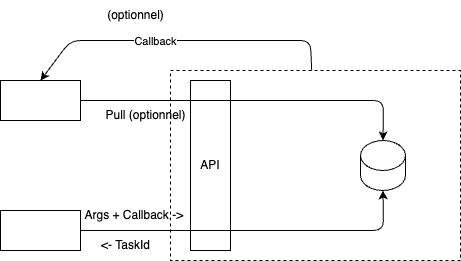
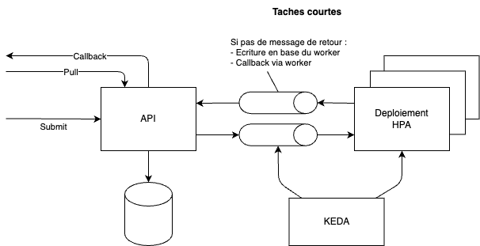
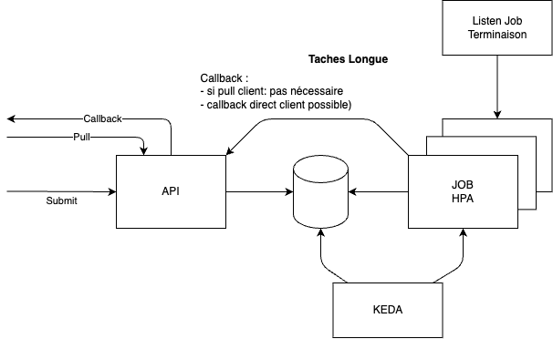

# Problématiques

Proposer des patrons d'architecture dédiés aux applications déployées dans Kubernetes et de nature asynchrone.

---

## Deux niveaux de lecture

1) D'un point de vue consommateur d'un service, je ne veux pas être dépendant de technologies de queue. Un service de plus haut niveau devrait m'être proposé. Cette interface est le niveau 1.
    - Enjeux: Découplage des services et technologies
2) D'un point de vue implémentation du service asynchrone, je voudrais avoir des guidelines d'implémentation, 
éventuellement par technologie utilisé dans mon périmètre de service.
    - Enjeux: Tuer la diversité (le foisonnement irrationnel) quand c'est possible. Pour simplifier à la fois la maintenance applicative (code source) et le travail des (Dev)Ops (middlewares et code des déploiements k8s).
---

## Pourquoi de l'asynchrone

Deux critères: 
- Pour gérer l'exécution de tâches sur des ressources limitées.
    - Exemple: service ayant un temps de traitement court, mais demandant des ressources RAM importantes empêchant une parallélisation importante (par exemple OCR - temps de traitement de quelques secondes par image mais nécessitant 300Mo par requete)
- Pour gérér des tâches longues.
    - Exemple: La capture MCR (plus d'1h de capture). Bien que cet exemple entre dans le cas précédent.

---

## Avantages de l'asynchrone:
- Découplage des services pour une meilleure scalabilité et maintenance.
- Asynchronisme pour ne pas bloquer les appels utilisateurs.
- Résilience aux pannes de services en isolant les traitements.
- Scalabilité horizontale des tâches longues.

---
# Architecture proposée

---

## Concept global

Hormis la partie interface consumer/producer, pour l'instant aucune technologie n'est évoquée :

1) Une API http de type "fire and forget" propose un endpoint permettant de déposer une demande d'exécution de tâche (en lui passant un callback permettant de faire une retour succès/erreur) et retourne l'id de la tâche correpondante.
2) Exécution de la tâche (cette partie sera abordée par la suite)
    - Mise à jour d'un état de base (en cours/fin/erreur)
3) Soit (mais non exclusif):
    - Appel du callback de fin d'exécution.
    - Exposition de l'API d'un enpoint en mode pull du statut de la tâche et du résultat.

---
## Schéma (Interface interne/externe)

---

## Tâches "courtes" (<2mn) sur ressources limitées

- Limite les latences en cas nominal (déploiements + queueing)
- Un worker peut traiter plusieurs messages (séquence et parallele).
- Déploiement OK à condition d'avoir une gracefull period < temps de traitement (tuning).

---

## Tâches "courtes" (<2mn) : Déclinaison
Déclinaisons:

- python (celery): redis 
- java/node: rabbitmq ou redis (moins de garanties mais pas de probleme de perf)

__Note__: Attention à bien gérer le SIGTERM et de ne plus écouter les nouvelles requêtes.

---

## Tâches "longues" 

- Temps de latence de démarrage négligeable au regard du temps de traitement.
- Un worker peut traiter un et un seul message par exécution (en réalité il est possible de traiter n messages en parallèle, mais en one shot).

---

## Tâches "longues" 

__Note__: Si la tâche longue est interruptible (différents steps de traitement courts <2mn), il est possible de revenir au concept des tâches courtes, à condition de gérer correctement les signaux SIGTERM (arret de l'écoute des événements d'entrée, fin du step courant, passage de la tâche courante à l'état non traité, requeue de la tâche).

---

# Composants

---

## API: Service Front-End / Orchestrateur

- Expose des endpoints REST.
- Ne fait que valider et publier des événements dans une file de messages.

---

## Broker de messages

- Sert à transmettre des événements à traiter par les microservices.
- Garantit la livraison au moins une fois, la durabilité et le buffering.

Exemples :
- Kafka (fort débit, persistance, relecture possible)
- RabbitMQ (routing fin, priorisation)
- SQS / SNS (cloud natif)
- NATS (léger et performant)
- BDD (dans le cas de tâches longues, émulé par BDD/Keda)

---

## Workers / Microservices consommateurs

- Écoute des événements (ex: OcrProcessingRequested, ...).
- Réalise le traitement long (par exemple : traitement ML, rendu PDF, etc.).
- Peut être scalable horizontalement (piloté via Keda: ScaledObjet pour les tâches courtes, ScaledJob pour les tâches longues).
- Peut pousser des événements en retour (OcrProcessed, ...).

---

## Notification Service

Envoie un e-mail ou callback HTTP au client avec le lien de téléchargement ou le message d’erreur.
Mergé avec la couche API dans les schémas précédents.

---

## Base de données / State Store

Permet de suivre l’état des traitements :

- En attente
- En cours
- Terminé
- Échec

Peut être interrogée par le front pour montrer l’état à l’utilisateur.

---

## Service de Callback (optionnel)

Permet aux clients d’enregistrer un callback URL à appeler une fois la tâche terminée.

